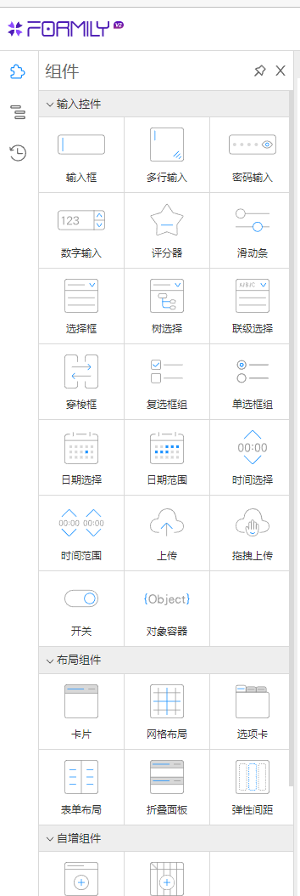

# 基于 Designable 开发 Taro 小程序低代码玩具系统

## designable介绍

`designable` 是一个设计器引擎，提供拖拽搭建能力。
我们可以用它来开发适合自己业务用的物料组件，往上层封装出具体产品，比如表单设计器、低代码平台来提升前端开发效率。

目前官方团队开发了一个 [antd表单设计器](https://designable-antd.formilyjs.org/)， 来看看它的颜值还是挺不错的


> 目前 designable 1.x版本非稳定正式版本，2.0 版本可能要2022年7月中旬发布<https://github.com/alibaba/designable/discussions/240>
> 一些非官方文章
[designable代码提交规范](https://www.yuque.com/xjchenhao/development/tmdayt)
[「表单设计器开发指南」的内容补充*](https://www.yuque.com/xjchenhao/development/gt1k7i)
[全局注册与状态管理](https://www.yuque.com/xjchenhao/development/fp8gv5)
[Designable 应用和源码浅析](https://zhuanlan.zhihu.com/p/431263711)

`designable` 本身只提供拖拉拽能力，要配合 [formily表单解决方案](https://react.formilyjs.org/zh-CN/api/components/schema-field) 的协议驱动能力(`标准JSON-Schema`) 才能实现低代码功能，类似于 [lowcode-engine](https://lowcode-engine.cn/)，包含 `入料`(让组件在低代码平台使用更容易)、`编排`(让拖拽、配置能力集成变得更简单)、`渲染`(运行时渲染，快速提供协议的渲染能力) 等核心能力。


按作者的理解，低代码系统由三个部分组成

- `低代码组件库`。前端展示组件，并且可以通过JSONSchema渲染出来。
- `PC端可视化编辑器`。通过简单的拖拽和编辑组件属性，产出代码或者JSONSchema。
- `低代码组件使用端`。业务场景接入低代码组件库，根据产出代码或者JSONSchema完成业务功能。

`物料` 与 `组件` 的区别就是物料只用于设计系统，在设计系统中拖拽编辑完后获得JSONSchema，然后在实际的项目中使用 `组件` 配合 `@formily/react` 渲染出来（formily也支持Vue）

**那么designable如何接入组件是呢？**

### antd表单设计器例子中，第一步是把antd适配到formily组件体系

例如[@formily/antd](https://antd.formilyjs.org/zh-CN/components)。

怎么接入自己需要的组件呢？

如果是使用第三方组件库，那么根据主框架是 `react` 或者 `vue` 可以分别用 [@formily/react](https://react.formilyjs.org/zh-CN/api/shared/connect) / [@formily/vue](https://vue.formilyjs.org/api/shared/connect.html) UI桥接层。


例如接入 `antd` 的 `Form.Item`，使用 `connnet` api去把组件"连接"到 `formily`。`mapProps` api可以映射组件的属性字段，`mapProps` 提供的 `field` 包含着 `Field模型属性`，例如字段的值、是否可编辑、是否非法等表单属性，我们可以取出来作为组件的 `props`

```tsx
import React, { useMemo } from 'react'
import { createForm } from '@formily/core'
import {
  FormProvider,
  FormConsumer,
  Field,
  connect,
  mapProps,
} from '@formily/react'
import { Input, Form, Button } from 'antd'

// FormItem UI组件
const FormItem = connect(
  Form.Item,
  mapProps(
    {
      title: 'label',
      description: 'extra',
      required: true,
      validateStatus: true,
    },
    (props, field) => {
      return {
        ...props,
        help: field.selfErrors?.length ? field.selfErrors : undefined,
      }
    }
  )
)
```

接入 `antd` 的 `Input` 组件

```js
import React from 'react'
import { connect, mapProps, mapReadPretty } from '@formily/react'
import { Input as AntdInput } from 'antd'
import { InputProps, TextAreaProps } from 'antd/lib/input'
import { PreviewText } from '../preview-text'
import { LoadingOutlined } from '@ant-design/icons'

type ComposedInput = React.FC<React.PropsWithChildren<InputProps>> & {
  TextArea?: React.FC<React.PropsWithChildren<TextAreaProps>>
}

export const Input: ComposedInput = connect(
  AntdInput,
  mapProps((props, field) => {
    return {
      ...props,
      suffix: (
        <span>
          {field?.['loading'] || field?.['validating'] ? (
            <LoadingOutlined />
          ) : (
            props.suffix
          )}
        </span>
      ),
    }
  }),
  mapReadPretty(PreviewText.Input)
)

Input.TextArea = connect(AntdInput.TextArea, mapReadPretty(PreviewText.Input))

export default Input
```

如果想接入自定义组件，具体可以参考[@formily/antd源码](https://github.com/alibaba/formily/tree/formily_next/packages/antd)

### 第二步是需要给组件添加在低代码系统中的行为和资源

给组件添加行为，最简单的就是描述一下组件有哪些属性需要在 `PC端低代码编辑器` 上编辑的。
给组件添加资源，最简单的理解就是添加一些在 `PC端低代码编辑器` 展示的内容，比如需要展示在左边组件区，那就需要一个icon


有了这些配置，就变成了低代码物料

例如 `antd` 的 `Input` 物料

```js
import React from 'react'
import { Input as FormilyInput } from '@formily/antd'
import { createBehavior, createResource } from '@designable/core'
import { DnFC } from '@designable/react'
import { createFieldSchema } from '../Field'
import { AllSchemas } from '../../schemas'
import { AllLocales } from '../../locales'

// 组件模版，这部分可以写的很复杂
export const CustomComponent: DnFC = ({ ...props }) => {
  // props对应Resource的x-component-props
  return (
    <div>
      {/* 也可以以高级组件的形式使用：{props.children}*/}
      <input type="text" {...props} />
    </div>
  );
};

export const Input: DnFC<React.ComponentProps<typeof FormilyInput>> =
  FormilyInput

Input.Behavior = createBehavior(
  {
    name: 'Input', // 物料名字
    extends: ['Field'], // 继承 Field模型 行为
    selector: (node) => node.props['x-component'] === 'Input', // 选择到该物料的条件 与Resource的x-component的值匹配上才生效
    designerProps: {
      // 需要进行配置的属性 例如输入框的 maxLength、placeholder 等
      // createFieldSchema的值如果是空对象，则“属性配置”面板中没有“组件属性”。
      // 如果把createFieldSchema换成createVoidFieldSchema函数，字段属性一栏将只保留必要的配置项。
      propsSchema: createFieldSchema(AllSchemas.Input),
    },
    designerLocales: AllLocales.Input,
  }
)

Input.Resource = createResource(
  {
    icon: 'InputSource', // // 体现在组件栏的icon
    elements: [
      {
        componentName: 'Field',

        // 下面的传参 就是formily的Field的属性配置。具体见此链接的文末：https://www.formilyjs.org/zh-CN/guide/quick-start#%E5%85%B7%E4%BD%93%E7%94%A8%E4%BE%8B
        props: {
          type: 'string', // 返回的数据类型，
          title: 'Input', // 对应“属性设置”里的标题字段
          'x-decorator': 'FormItem', // 目前只有`FormItem`值会改变组件形态为“表单字段”，填其它值跟没写没有两样。如果不希望组件以表单字段的形式呈现，不写x-decorator和title字段即可。
          'x-component': 'Input', // 对应的组件
          // 组件“属性设置”的默认值，也会体现在组件的props中。
          'x-component-props': {
            placeholder: '占位占位',
            maxLength: 3,
          },
        },
      },
    ],
  }
)

```
