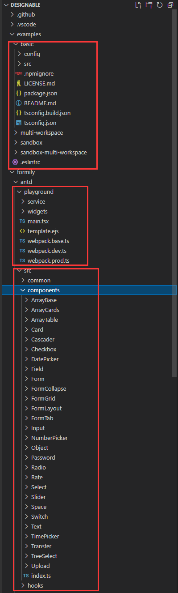

# 基于 Designable 开发 Taro 小程序低代码玩具系统

## designable介绍

designable是一个设计器引擎，提供拖拽搭建能力。
我们可以用它来开发适合自己业务用的物料组件，往上层封装出具体产品，比如表单设计器、低代码平台来提升前端开发效率。

来看看它的颜值，还挺不错的


体验地址<https://designable-antd.formilyjs.org/>

> 目前 designable 1.x版本非稳定正式版本，2.0 版本可能要2022年7月中旬发布<https://github.com/alibaba/designable/discussions/240>

一些非官方文章
[designable代码提交规范](https://www.yuque.com/xjchenhao/development/tmdayt)
[「表单设计器开发指南」的内容补充*](https://www.yuque.com/xjchenhao/development/gt1k7i)
[全局注册与状态管理](https://www.yuque.com/xjchenhao/development/fp8gv5)
[Designable 应用和源码浅析](https://zhuanlan.zhihu.com/p/431263711)

## designable源码介绍

[GitHub地址](https://github.com/alibaba/designable)

拉下来后看看目录结构


该项目使用了 `lerna` + `yarn` 的 `Monorepo` 方案，启动起来稍微有点麻烦

`example/basic` 是 designable基础工程，没有什么物料。基础工程我抽出来一个[简单的工程](https://github.com/weilaiqishi/designable-basicPlayground)，使用 `yarn` 和 `yarn start` 既可启动

`formily/antd` 是 基于 `@formily/antd` 组件库开发的designable物料，`formily/antd/playground` 就是使用该物料的designable设计系统。

`物料` 与 `组件` 的区别就是物料只用于设计系统，在设计系统中拖拽编辑完后获得JSONSchema，然后在实际的项目中使用 `组件` 配合 `@formily/react` 渲染出来（formily也支持Vue）

[formily官网](https://formilyjs.org/zh-CN)

如果你要开发适合自己业务的组件并准备用它开发 `designable` 物料，那就得让组件适配 `formily`：

[对第三方组件库的无侵入接入 Formily](https://react.formilyjs.org/zh-CN/api/shared/connect)
例如改造 `antd` 的 `Form.Item`

```tsx
import React, { useMemo } from 'react'
import { createForm } from '@formily/core'
import {
  FormProvider,
  FormConsumer,
  Field,
  connect,
  mapProps,
} from '@formily/react'
import { Input, Form, Button } from 'antd'

// FormItem UI组件
const FormItem = connect(
  Form.Item,
  mapProps(
    {
      title: 'label',
      description: 'extra',
      required: true,
      validateStatus: true,
    },
    (props, field) => {
      return {
        ...props,
        help: field.selfErrors?.length ? field.selfErrors : undefined,
      }
    }
  )
)
```

具体可以参考[@formily/antd源码](https://github.com/alibaba/formily/tree/formily_next/packages/antd)来开发组件库

## formily-taro

如上所诉，要开发基于 `Designable` 的 `Taro` 小程序低代码系统，我们首先得准备适配 `formily` 的组件库

模仿 `taro-ui` 起一个 `formily-taro-ui` 的工程放UI组件

使用 `@tarojs/cli` 起一个名叫 `formily-taro-demo` 的 taro工程

技术选型: `Taro@3.5beta` + `React` + `Mobx` + `Taro-ui`。虽然很想用 `nutui` ，但是官方还没有出 Taro + React 版本

用 lerna + yarn 去组织这个 Monorepo

[lerna多包管理实践](https://juejin.cn/post/6844904194999058440)

designable-basicPlayground
