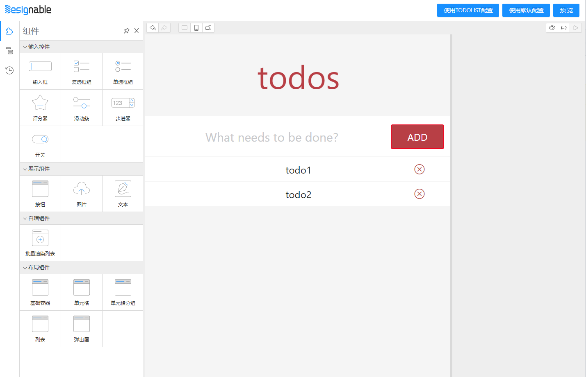
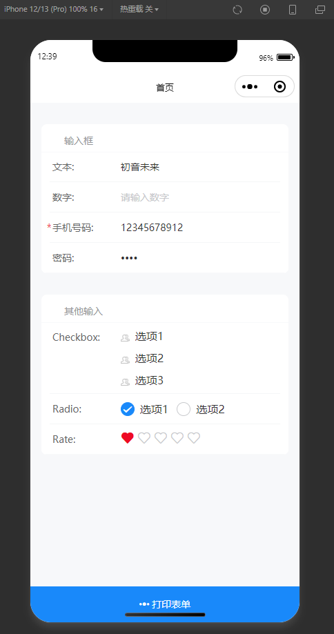
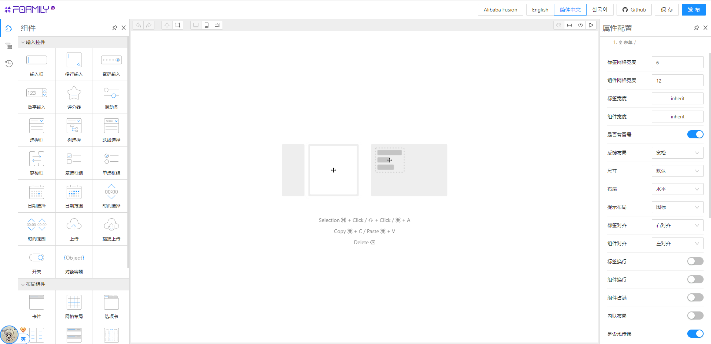
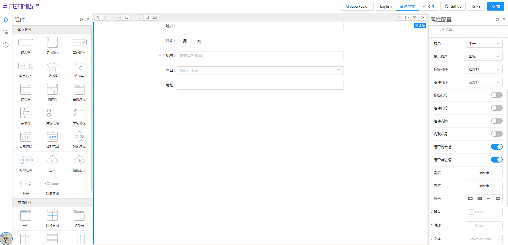

# 基于 Designable 开发 Taro 小程序低代码玩具系统(0)

## 预览地址

[Github](https://github.com/weilaiqishi/lowcode-designable-taro-react.git)

可视化设计器（体积很大，注意流量，最好用PC打开） <https://miku01.cn/taroifyDesignable/index.html>
demo H5（按 F12 切换设备仿真） <https://miku01.cn/taroifyDemo/index.html#/pages/index/index>




## designable介绍

> 组件化搭建领域抽象的最好的搭建引擎，与formily同样的配方，不同的只是解决的不同问题，作为底层搭建引擎，它该有的能力都有，最基础的拖拽，就支持了很多形态的，比如，多选拖拽，跨区域拖拽，跨工作区拖拽，跨iframe拖拽，还有多选，快捷键多选，shift/ctrl加点击交集化多选，还有基于鼠标形态切换的选区式多选，再说说扩展性，它本身内核是一个框架无关的内核，只负责管理模型状态，然后我们想要扩展ui的话，只需要替换ui组件即可，designable本身提供了一系列开箱即用的ui组件，且是绝对遵循组合模式的方案，不搞黑盒插件模式，你想用就用它，不想用就替换它，因为组件本身是无状态的，状态都在内核中管理，所以这就使得了designable的扩展性，极其的强

如上 `designable` [开源库作者](https://www.zhihu.com/question/458478254/answer/1978603907)所述，`designable` 是一个设计器引擎，提供拖拽搭建能力。
我们可以用它来往上层封装出具体产品，比如表单设计器、低代码平台。

formily表单设计器，就是基于designable扩展出来的。
[这是预览地址](https://designable-antd.formilyjs.org/)， 颜值非常得高



平时我的工作任务主要小程序开发，接下来文章会去介绍怎么开发 **Taro小程序前端页面可视化搭建工具**

> - 目前 designable 1.x版本非稳定正式版本，2.0 版本可能要2022年7月中旬发布<https://github.com/alibaba/designable/discussions/240>
> - 目前没有文档，可以先看一些非官方文章或视频教程
> - [表单设计器开发指南](https://formilyjs.org/zh-CN/guide/form-builder)
> - [「表单设计器开发指南」的内容补充*](https://www.yuque.com/xjchenhao/development/gt1k7i)
> - [Designable 应用和源码浅析](https://zhuanlan.zhihu.com/p/431263711)
> - [Formily实践（1.x）](https://zhuanlan.zhihu.com/p/142237587)
> - [formily+vue3 组件桥接和具名插槽使用的两种方法](https://www.bilibili.com/video/BV1nT41137fz?p=1&share_medium=iphone&share_plat=ios&share_session_id=02D5C73F-30C0-49D5-A9DF-DC3154E7392E&share_source=COPY&share_tag=s_i&timestamp=1656643643&unique_k=WKpUj83&vd_source=f7755c17614e213e2d79a4ab2d1a8de8)
> - 低代码入门介绍
> - [低代码渲染那些事](https://zhuanlan.zhihu.com/p/540339437)
> - [从实现原理看低代码](https://zhuanlan.zhihu.com/p/451340998)

## 前端页面可视化搭建与低代码

首先厘清一下本文的开发范围。一般市面上推出的低代码产品会包含 界面可视化搭建、后端数据存储、应用管理发布等功能，偏向零代码方案面向非开发者；但如 `lowcode-engine` [阿里低代码引擎文档](https://lowcode-engine.cn/docV2/intro)中所说，低代码本身也不仅仅是为技术小白准备的。在实践中，低代码因为通过组件化、模块化的思路让业务的抽象更加容易，而且在扩展及配置化上带来了更加新鲜的模式探索，技术人员的架构设计成本和实施成本也就降了很多。作为前端开发者，我们接下来先重点关注 `web前端页面可视化搭建` 如何开发。

低代码渲染有一个简单的公式


按这个公式的理解，可视化搭建中有三个角色

- `组件库`。前端展示组件，不利用 JSONSchema 也可以像 `antd` 一样普通的用代码展示出来。
- `协议和渲染器`。渲染器根据协议解析 JSONSchema 最终展示出组件。
- `可视化设计器`。基于渲染器展示界面，加入拖拽和配置能力，高效产出 JSONSchema。

可以说 `组件库` 和 `渲染器` 是基础，有了这两消费端已经可以进行渲染了，`可视化设计器` 是锦上添花。

`渲染器` 大概要做以下内容：

- 获取源码组件
- 解析组件的 props
- 获取组件的 children
- 保留并传入上下文，包括循环上下文，插槽上下文等;
- 节点更新，当参数变化时需要更新对应的节点

## formily表单设计器介绍

`formily表单设计器` 约等于 使用了`antd`组件的可视化设计器，我们先了解一下大致是怎么实现的

### 协议、渲染器 与 组件库

`designable` 本身只提供拖拉拽等能力，协议、渲染器 主要依赖 [formily表单解决方案](https://react.formilyjs.org/zh-CN/api/components/schema-field) 的协议驱动能力(`标准JSON-Schema`)


**组件适配协议，要基于@formily的api进行改造**，适配协议后好处就是我们可以依赖 `Formily` MVVM的能力，不止可以渲染页面，还可以低成本地 `支配` 页面，如 表单校验、异步数据源、[页面联动逻辑](https://formilyjs.org/zh-CN/guide/advanced/linkages)，最简单的例子是根据用户行为决定一个组件的显示和隐藏，就这么一个简单的需求很多低代码产品都不支持。

怎么接入可以参考[@formily/antd](https://antd.formilyjs.org/zh-CN/components)

如果是使用第三方组件库，那么根据主框架是 `react` 或者 `vue` 可以分别用 [@formily/react](https://react.formilyjs.org/zh-CN/api/shared/connect) / [@formily/vue](https://vue.formilyjs.org/api/shared/connect.html) UI桥接层。


例如接入 `antd` 的 `Form.Item`，使用 `connnet` api去把组件"连接"到 `formily`。`mapProps` api可以映射组件的属性字段，`mapProps` 提供的 `field` 包含着 `Field模型属性`，例如字段的值、是否可编辑、是否非法等表单属性，我们可以取出来作为组件的 `props`

```tsx
import React, { useMemo } from 'react'
import { createForm } from '@formily/core'
import {
  FormProvider,
  FormConsumer,
  Field,
  connect,
  mapProps,
} from '@formily/react'
import { Input, Form, Button } from 'antd'

// FormItem UI组件
const FormItem = connect(
  Form.Item,
  mapProps(
    {
      title: 'label',
      description: 'extra',
      required: true,
      validateStatus: true,
    },
    (props, field) => {
      return {
        ...props,
        help: field.selfErrors?.length ? field.selfErrors : undefined,
      }
    }
  )
)
```

接入 `antd` 的 `Input` 组件，别看代码里面没做什么属性映射，实际上是 formily 的 [Field模型](https://core.formilyjs.org/zh-CN/api/models/field)与 `AntdInput` 已经对齐了 `values`、`disabled` 等核心表单属性，并且在设计器上配置的 `style`、`maxLength` 等属性是可以透传的。

```js
import React from 'react'
import { connect, mapProps, mapReadPretty } from '@formily/react'
import { Input as AntdInput } from 'antd'
import { InputProps, TextAreaProps } from 'antd/lib/input'
import { PreviewText } from '../preview-text'
import { LoadingOutlined } from '@ant-design/icons'

type ComposedInput = React.FC<React.PropsWithChildren<InputProps>> & {
  TextArea?: React.FC<React.PropsWithChildren<TextAreaProps>>
}

export const Input: ComposedInput = connect(
  AntdInput,
  mapProps((props, field) => {
    return {
      ...props,
      suffix: (
        <span>
          {field?.['loading'] || field?.['validating'] ? (
            <LoadingOutlined />
          ) : (
            props.suffix
          )}
        </span>
      ),
    }
  }),
  mapReadPretty(PreviewText.Input)
)

Input.TextArea = connect(AntdInput.TextArea, mapReadPretty(PreviewText.Input))

export default Input
```

### 设计器处理

#### 首先组件要添加在编排系统中的 `行为` 和 `资源`

给组件添加行为，大致就是描述一下组件有哪些属性需要在 `设计器` 上配置的，可以配置哪些内容，还有 `设计器` 与组件的交互，例如点击、拖拉这个组件会有什么反应。
给组件添加资源，简单的理解就是添加一些在 `设计器` 展示的内容，比如需要展示在左边组件区，那就需要一个icon


有了这些配置，组件就变成了 `低代码物料`

例如 `antd` 的 `Input` 物料

```js
import React from 'react'
import { Input as FormilyInput } from '@formily/antd'
import { createBehavior, createResource } from '@designable/core'
import { DnFC } from '@designable/react'
import { createFieldSchema } from '../Field'
import { AllSchemas } from '../../schemas'
import { AllLocales } from '../../locales'

// 组件模版，这部分可以写的很复杂
export const CustomComponent: DnFC = ({ ...props }) => {
  // props对应Resource的x-component-props
  return (
    <div>
      {/* 也可以以高级组件的形式使用：{props.children}*/}
      <input type="text" {...props} />
    </div>
  );
};

export const Input: DnFC<React.ComponentProps<typeof FormilyInput>> =
  FormilyInput

Input.Behavior = createBehavior(
  {
    name: 'Input', // 物料名字
    extends: ['Field'], // 继承 Field模型 行为
    selector: (node) => node.props['x-component'] === 'Input', // 选择到该物料的条件 与Resource的x-component的值匹配上才生效
    designerProps: {
      // 需要进行配置的属性 例如输入框的 maxLength、placeholder 等
      // createFieldSchema的值如果是空对象，则“属性配置”面板中没有“组件属性”。
      // 如果把createFieldSchema换成createVoidFieldSchema函数，字段属性一栏将只保留必要的配置项。
      propsSchema: createFieldSchema({
        type: 'object',
        properties: {
          addonBefore: {
            type: 'string',
            'x-decorator': 'FormItem',
            'x-component': 'Input',
          },
          addonAfter: {
            type: 'string',
            'x-decorator': 'FormItem',
            'x-component': 'Input',
          },
          prefix: {
            type: 'string',
            'x-decorator': 'FormItem',
            'x-component': 'Input',
          },
          suffix: {
            type: 'string',
            'x-decorator': 'FormItem',
            'x-component': 'Input',
          },
          allowClear: {
            type: 'boolean',
            'x-decorator': 'FormItem',
            'x-component': 'Switch',
          },
          bordered: {
            type: 'boolean',
            'x-decorator': 'FormItem',
            'x-component': 'Switch',
            'x-component-props': {
              defaultChecked: true,
            },
          },
          maxLength: {
            type: 'number',
            'x-decorator': 'FormItem',
            'x-component': 'NumberPicker',
          },
          placeholder: {
            type: 'string',
            'x-decorator': 'FormItem',
            'x-component': 'Input',
          },
          size: {
            type: 'string',
            enum: ['large', 'small', 'middle', null],
            'x-decorator': 'FormItem',
            'x-component': 'Select',
            'x-component-props': {
              defaultValue: 'middle',
            },
          },
        },      
      }),      
    },
    designerLocales: {
      'zh-CN': {
        title: '输入框',
        settings: {
          'x-component-props': {
            addonAfter: '后缀标签',
            addonBefore: '前缀标签',
            maxLength: '最大长度',
            prefix: '前缀',
            suffix: '后缀',
            autoSize: {
              title: '自适应高度',
              tooltip: '可设置为 true | false 或对象：{ minRows: 2, maxRows: 6 }',
            },
            showCount: '是否展示字数',
            checkStrength: '检测强度',
          },
        },
      },
    },
  }      
)

Input.Resource = createResource(
  {
    icon: 'InputSource', // // 体现在组件栏的icon
    elements: [
      {
        componentName: 'Field',

        // 下面的传参 就是formily的Field的属性配置。具体见此链接的文末：https://www.formilyjs.org/zh-CN/guide/quick-start#%E5%85%B7%E4%BD%93%E7%94%A8%E4%BE%8B
        props: {
          type: 'string', // 返回的数据类型，
          title: 'Input', // 对应“属性设置”里的标题字段
          'x-decorator': 'FormItem', // 目前只有`FormItem`值会改变组件形态为“表单字段”，填其它值跟没写没有两样。如果不希望组件以表单字段的形式呈现，不写x-decorator和title字段即可。
          'x-component': 'Input', // 对应的组件
          // 组件“属性设置”的默认值，也会体现在组件的props中。
          'x-component-props': {
            placeholder: '占位占位',
            maxLength: 3,
          },
        },
      },
    ],
  }
)

```

#### 第二步要使用 `@formily/react` 生成运行时渲染器，给它丢一个JSON就能渲染起来

```tsx
import React, { useMemo } from 'react'
import { createForm } from '@formily/core'
import { createSchemaField } from '@formily/react'
import {
    Input,
    ...
} from '@formily/antd'
import { Card, Slider, Rate } from 'antd' // 一些简单的布局组件或输入组件，即使不适配也能用起来
import { TreeNode } from '@designable/core'
import { transformToSchema } from '@designable/formily-transformer'

const SchemaField = createSchemaField({
  components: {
    Input,
    Card,
    ...
  },
})

export interface IPreviewWidgetProps {
  tree: TreeNode
}

export const PreviewWidget: React.FC<IPreviewWidgetProps> = (props) => {
  const form = useMemo(() => createForm(), [])
  const { form: formProps, schema } = transformToSchema(props.tree)
  return (
    <Form {...formProps} form={form}>
      <SchemaField schema={schema} />
    </Form>
  )
}
```

#### 最后一步就是把物料放入 设计器的 `资源区` 和 `组件树编辑区`

```tsx
    <Designer engine={engine}>
      <StudioPanel>
        <CompositePanel>
          <CompositePanel.Item title="panels.Component" icon="Component">
            <ResourceWidget // 物料选择区
              title="sources.Inputs"
              sources={[
                Input, // 放入了Input物料
                Password,
                NumberPicker,
                ...
              ]}
            />
          </CompositePanel.Item>
          <CompositePanel.Item title="panels.OutlinedTree" icon="Outline" >
            <OutlineTreeWidget /> // 树骨架编辑区
          </CompositePanel.Item>
          <CompositePanel.Item title="panels.History" icon="History">
            <HistoryWidget /> // 编辑历史记录
          </CompositePanel.Item>
        </CompositePanel>
        <Workspace id="form">
          <WorkspacePanel>
            <ToolbarPanel>
              <DesignerToolsWidget />
              <ViewToolsWidget
                // 面板切换  拖拉拽面板、JSON编辑面板、预览面板
                use={['DESIGNABLE', 'JSONTREE', 'PREVIEW']}
              />
            </ToolbarPanel>
            <ViewportPanel style={{ height: '100%' }}>
              <ViewPanel type="DESIGNABLE">
                {() => (
                  <ComponentTreeWidget // 组件树编辑区 使用了 @designable/react 渲染器，意思就是支持了拖拉拽，但是没有了formily MVVM能力
                    components={{
                      Form,
                      Field,
                      Input, // 放入了Input物料
                      Select,
                      TreeSelect,
                      ...
                    }}
                  />
                )}
              </ViewPanel>
              <ViewPanel type="JSONTREE" scrollable={false}>
                {(tree, onChange) => (
                  <SchemaEditorWidget tree={tree} onChange={onChange} />
                )}
              </ViewPanel>
              <ViewPanel type="PREVIEW">
                {(tree) => <PreviewWidget tree={tree} />}
              </ViewPanel>
            </ViewportPanel>
          </WorkspacePanel>
        </Workspace>
      </StudioPanel>
    </Designer>
```

这一大串代码下来可能读者已经晕了，但是莫得办法，现在还没有官方文档。
但是我们不用理解得很深刻，只需要照猫画虎就能开发好 `组件物料`，配置到设计器中就能搞起来了
