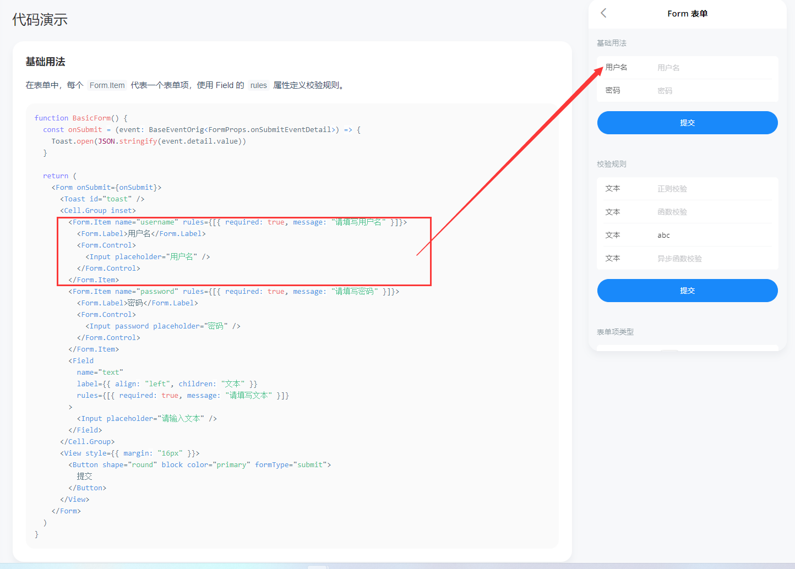
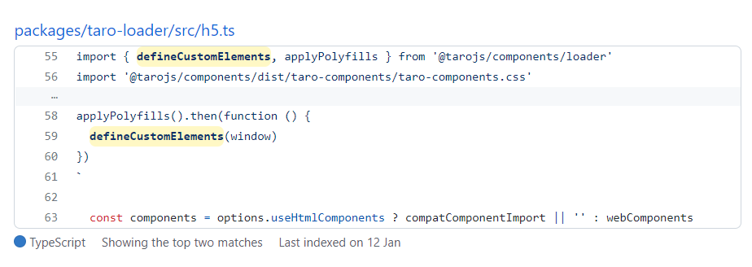
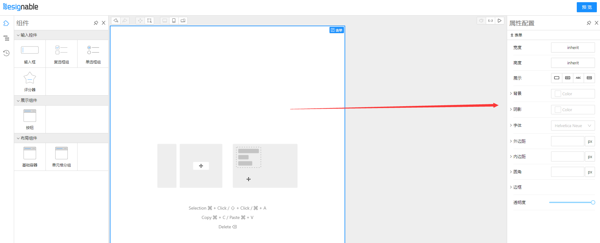
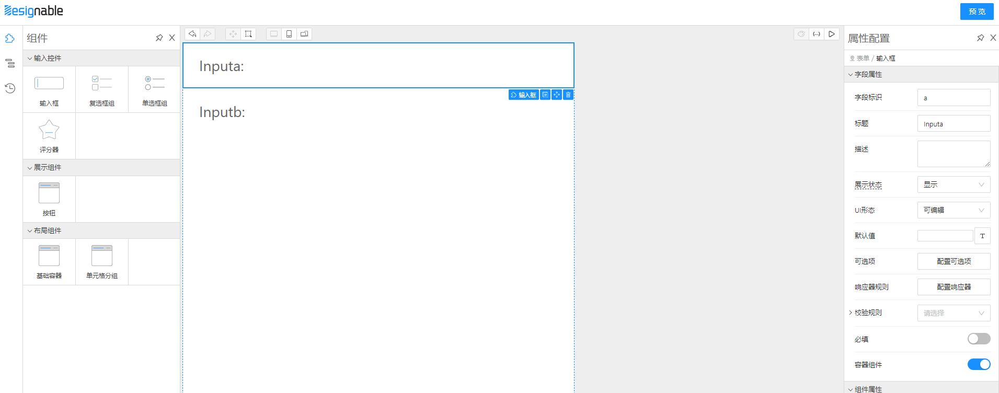
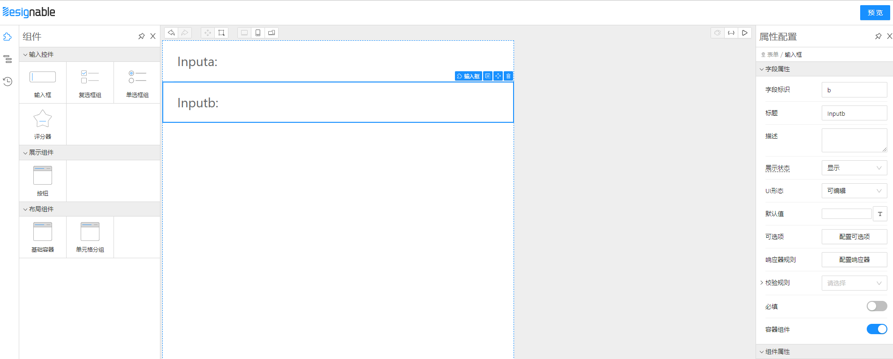
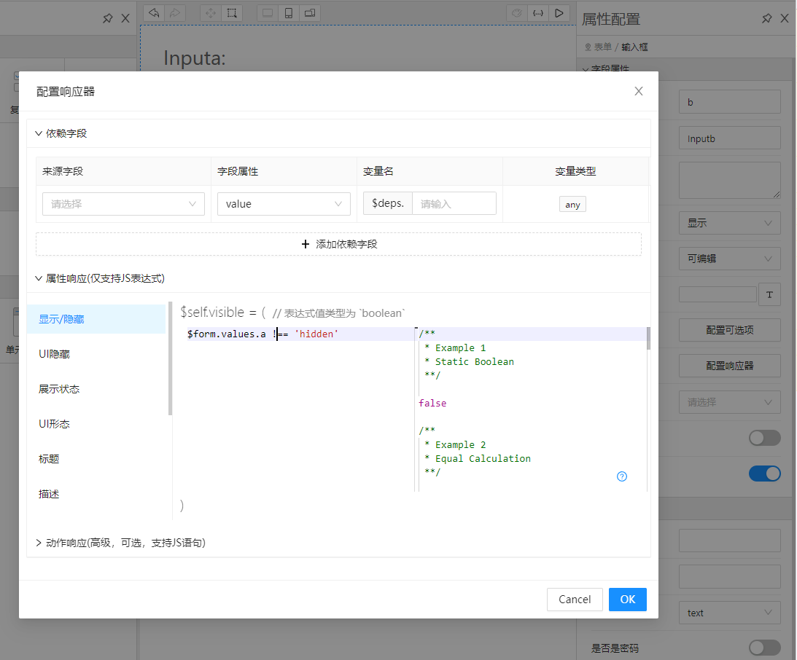
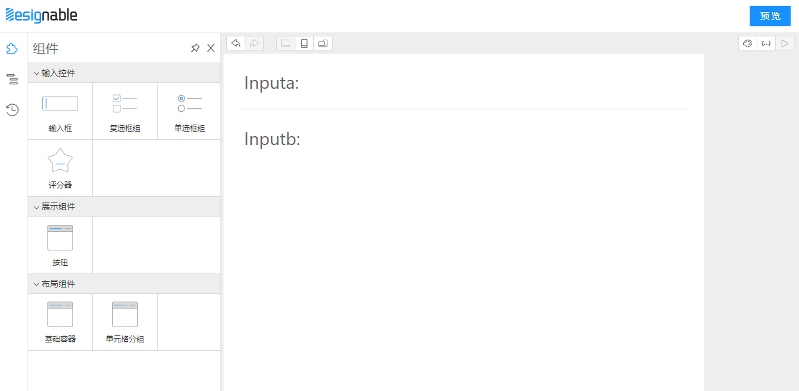
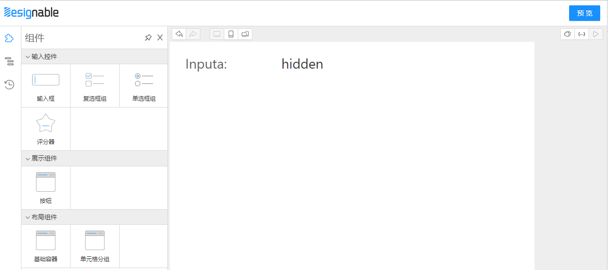

# 基于 Designable 开发 Taro 小程序低代码玩具系统(1)

开搞开搞

## 预览地址

[Github](https://github.com/weilaiqishi/lowcode-designable-taro-react.git)

可视化设计器（体积很大，注意流量，最好用PC打开） <https://miku01.cn/taroifyDesignable/index.html>

demo H5（按 F12 切换设备仿真） <https://miku01.cn/taroifyDemo/index.html#/pages/index/index>


## 组件库准备 taroify-formily

我们需要挑一个称手的Taro组件库

目前京东出的组件库中 `taro-ui` 没什么更新了，`NutUI`只支持 Vue 不支持 React，所以选择了个人开发的 `taroify`，由于是从 `vant` 改来的，所以颜值也比较高，[文档地址](https://taroify.gitee.io/taroify.com/introduce/)

### Form组件

Form组件是地基，接收一个Form实例，渲染children内容。
`@formily/antd` 中一个简单的示例如下

```tsx
import React from 'react'
import { Input,Form,FormItem,Submit, } from '@formily/antd'
import { createForm } from '@formily/core'
import { Field } from '@formily/react'

const form = createForm()

export default () => (
  <Form
    form={form}
    layout="vertical"
    feedbackLayout="terse"
    onAutoSubmit={console.log}
    onAutoSubmitFailed={console.log}
  >
      <Field
        name="bb"
        title="输入框"
        required
        decorator={[FormItem]}
        component={[Input]}
      />
  </Form>
)
```

根据 `@formily/antd` 的代码，照猫画虎出属于我们的Form组件，除了formily提供的能力外就是一个Taro的View组件

```tsx
import React, { createContext, useContext } from 'react'
import { Form as FormType, ObjectField } from '@formily/core'
import {
  ExpressionScope,
  FormProvider,
  JSXComponent,
  useParentForm,
} from '@formily/react'
import { View as TaroView } from '@tarojs/components'

import { PreviewText } from '../PreviewText'

const View: any = TaroView // 这是为了处理类型报错，请不要在意

export interface IFormLayoutProps {
  form?: FormType
  component?: JSXComponent
  previewTextPlaceholder?: React.ReactNode
  className?: string
  style?: React.CSSProperties
}

export const Form: React.FC<React.PropsWithChildren<IFormLayoutProps>> = ({
  form,
  component,
  previewTextPlaceholder,
  className,
  style,
  children
}) => {
  const top = useParentForm() // 获取父表单 现在并不重要
  // 重要的是这里 我们的Form组件就简单的用Taro的View组件包住子组件渲染
  // ExpressionScope是用context来给 json-schema 表达式传递局部作用域，我们可以用它当做数据源
  // PreviewText.Placeholder也是一个context 给预览态显示文本一个缺省值，目前也不重要
  const renderContent = (_form: FormType | ObjectField) => (
    <ExpressionScope value={{ $$form: _form }}>
      <PreviewText.Placeholder value={previewTextPlaceholder}>
        <View className={className} style={style}>
          {children}
        </View>
      </PreviewText.Placeholder>
    </ExpressionScope>
  )
  if (form)
    // 最重要的是这里，有FormProvider才能提供MVVM能力，进行微操 
    return <FormProvider form={form}>{renderContent(form)}</FormProvider>
  if (!top) throw new Error('must pass form instance by createForm')
  return renderContent(top)
}

Form.defaultProps = {
  component: 'form',
}

export default Form
```

### FormItem

`taroify` 提供了一些表单组件


如图所见FormItem的作用就是显示label、必填、校验文案等，并且让表单布局更加美观，我们需要混入Formily能力。

首先介绍 `pickDataProps` 方法，这个方法主要挑选出 `@designable/react` `ComponentTreeWidget` 渲染器给的属性，在设计器中这些属性挂在dom上才能点击选中、拖拉拽。

```ts
export const pickDataProps = (props: any = {}) => {
  const results = {}

  for (const key in props) {
    if (key.indexOf('data-') > -1) {
      results[key] = props[key]
    }
  }

  return results
}
```

接着我们改造一下FormItem的最外层，要让designable属性能够挂到dom上，并且阉割掉原来UI库有关Form的功能，化为己用。
`<CellBase {...pickDataProps(_props)}` 这段代码就是处理designable属性的

```tsx
// fork for supporting designable props

import * as React from 'react'
import {
  Children,
  isValidElement,
  ReactElement,
  ReactNode,
  useMemo,
} from 'react'
import { CellBase, CellProps, CellValue } from '@taroify/core/cell'
import Form from '@taroify/core/form'
import { prefixClassname } from '@taroify/core/styles'
import { isElementOf } from '@taroify/core/utils/validate'
import { cloneIconElement } from '@taroify/icons/utils'
import { View as _View } from '@tarojs/components'
import { InputProps } from '@tarojs/components/types/Input'
import classNames from 'classnames'
import * as _ from 'lodash'

import { pickDataProps } from '../components/__builtins__'

const View: any = _View
export interface FormItemProps extends CellProps {
  name?: string
  defaultValue?: any
  required?: boolean
  children?: ReactNode
}

interface FormItemChildren {
  label?: ReactElement
  control?: ReactElement
  feedbacks?: ReactElement[]
}

function useFormItemChildren(children?: ReactNode): FormItemChildren {
  return useMemo<FormItemChildren>(() => {
    const __children__: FormItemChildren = {
      feedbacks: [],
    }

    Children.forEach(children, (child: ReactNode) => {
      if (!isValidElement(child)) {
        return
      }

      const element = child as ReactElement
      const { type: elementType } = element as ReactElement<InputProps>
      if (isElementOf(element, Form.Label)) {
        __children__.label = element
      } else if (elementType === Form.Control) {
        __children__.control = element
      } else if (isElementOf(element, Form.Feedback)) {
        __children__.feedbacks?.push(element)
      }
    })
    return __children__
  }, [children])
}

const FormItem = (props: FormItemProps) => {
  const {
    className,
    style,
    name,
    defaultValue,
    align,
    bordered,
    icon,
    rightIcon,
    clickable,
    required,
    children: childrenProp,
    onClick,
    ..._props
  } = props

  const { label, control, feedbacks } = useFormItemChildren(childrenProp)

  const explain = useMemo(
    () => !_.isEmpty(feedbacks),
    [feedbacks]
  )

  return (
    <CellBase
      {...pickDataProps(_props)}
      className={classNames(prefixClassname('form-item'), className)}
      style={style}
      bordered={bordered}
      align={align}
      clickable={clickable}
      icon={cloneIconElement(icon, {
        className: prefixClassname('form-item__icon'),
      })}
      rightIcon={cloneIconElement(rightIcon, {
        className: prefixClassname('form-item__right-icon'),
      })}
      required={required}
      onClick={onClick}
    >
      {label}
      <CellValue alone={false}>
        {control}
        {explain && (
          <View className={classNames(prefixClassname('form__feedbacks'))}>
            {feedbacks}
          </View>
        )}
      </CellValue>
    </CellBase>
  )
}

export default FormItem

```

最后封装出我们自己的 `FormItem`，让它可以只根据最外层的props就能发挥出最大功能。这里我们先提供简单的对齐方式配置、冒号配置，同时我们需要用 `mapProps` 去映射校验文案字段。

```tsx
/* eslint-disable react/no-children-prop */
import React from 'react'
import { GeneralField, isVoidField } from '@formily/core'
import { connect, mapProps } from '@formily/react'
import { Field, Form } from '@taroify/core'
import { createVariantElement } from '@taroify/core/utils/element'
import { View as TaroView } from '@tarojs/components'
import classNames from 'classnames'

import FormItemBase from '../../ui/form-item'
import { pickDataProps } from '../__builtins__'

const View: any = TaroView

export interface IFormItemProps {
  className?: string
  style?: React.CSSProperties
  field: GeneralField
  colon: boolean // 是否有冒号
  labelAlign?: 'left' | 'center' | 'right' // label对齐方式
  wrapperAlign?: 'left' | 'center' | 'right' // 组件对齐方式
  feedbackStatus?: 'error' | 'warning' | 'success' | 'pending'
  [propName: string]: any
}

export const BaseItem: React.FC<React.PropsWithChildren<IFormItemProps>> = ({
  className,
  style,
  children,
  field,
  colon = true,
  labelAlign = 'left',
  wrapperAlign = 'left',
  feedbackStatus,
  feedbackText,
  ...props
}) => {
  const required =
    !isVoidField(field) && field.required && field.pattern !== 'readPretty'
  return (
    <FormItemBase
      required={required}
      bordered
      className={className}
      style={style}
      {...pickDataProps(props)}
    >
      <Form.Label align={labelAlign} colon={colon}>
        {field.title}
      </Form.Label>
      {children && <Form.Control children={children} align={wrapperAlign} />}
      {feedbackStatus !== 'pending' && (
        <Form.Feedback
          status={
            feedbackStatus === 'success'
              ? 'valid'
              : feedbackStatus === 'error'
                ? 'invalid'
                : 'warning'
          }
        >
          {feedbackText}
        </Form.Feedback>
      )}
    </FormItemBase>
  )
}

export const FormItem = connect(
  BaseItem,
  mapProps((props, field) => {
    if (isVoidField(field))
      return {
        ...props,
        field,
      }
    const takeFeedbackStatus = () => {
      if (field.validating) return 'pending'
      return field.decoratorProps.feedbackStatus || field.validateStatus
    }
    const takeMessage = () => {
      const split = (messages: any[]) => {
        return messages.reduce((buf, text, index) => {
          if (!text) return buf
          return index < messages.length - 1
            ? buf.concat([text, ', '])
            : buf.concat([text])
        }, [])
      }
      if (field.validating) return
      if (props.feedbackText) return props.feedbackText
      if (field.selfErrors.length) return split(field.selfErrors)
      if (field.selfWarnings.length) return split(field.selfWarnings)
      if (field.selfSuccesses.length) return split(field.selfSuccesses)
    }
    return {
      ...props,
      field,
      feedbackStatus: takeFeedbackStatus(),
      feedbackText: takeMessage(),
    }
  })
)
```

### Input

Input组件适配Formily代码如下

```tsx
import React from 'react'
import { connect, mapProps, mapReadPretty } from '@formily/react'
import { Input as component } from '@taroify/core'

import { PreviewText } from '../PreviewText'

export const Input = connect(
  component,
  mapProps((props, field) => {
    return {
      ...props
    }
  }),
  mapReadPretty(PreviewText.Input)
)
```

是不是灰常简单

### SchemaField

最后我们用 `createSchemaField` 包一层，生成属于 `taroify` 的渲染器

```ts
import { createSchemaField } from '@formily/react'

import {
  Button,
  CellGroup,
  Checkbox,
  DatetimePicker,
  FormItem,
  Input,
  Radio,
  Rate,
  Slider,
  Stepper,
  Switch,
  WidgetBase,
} from './index'

export const SchemaField = createSchemaField({
  components: {
    Button,
    CellGroup,
    Checkbox,
    DatetimePicker,
    FormItem,
    Input,
    Radio,
    Rate,
    Slider,
    Stepper,
    Switch,
    WidgetBase,
  },
})

```

组件库准备好了之后，我们可以选择用 `rollup` 打包，也可以选择在项目中直接使用 `tsx` 文件。

## designable使用Taro组件

由于 `Taro` 跨端的特性，让组件库在 `h5` 环境下展示是一定可以的，不过有两种方案：

1. 用完整的Taro项目，接入部分designable能力，最后以iframe的形式嵌入PC设计器中
2. PC设计器营造 `h5` 端的氛围，让Taro组件直接展示，不经过 `@tarojs/cli` 打包

我选择了方案二，感觉比较简单，因为不需要跨iframe通信，而且觉得`@tarojs/cli`打包到h5比较慢（这里没有经过验证）。

**那么如何营造 `Taro h5` 氛围呢？**
首先 `@tarojs/components` 使⽤了 `Stencil` 去实现了⼀个基于 `WebComponents` 且遵循微信⼩程序规范的组件库，用 `reactify-wc` 让React项目中能够使用 `WebComponent`，`stenciljs` 打包的组件产物中有 `defineCustomElements`，调用一下才可以把 `WebComponents` 注册到浏览器中

我们在设计器项目中需要把该方法导出来用一下，还需要引入Taro组件样式

在设计器 `main.tsx` 中

```tsx
import { defineCustomElements } from '@tarojs/components/dist/esm/loader.js'
import '@tarojs/components/dist/taro-components/taro-components.css'
defineCustomElements(window)
```

接着webpack配置还要处理两个地方

```ts
export default {
  resolve: {
    modules: ['node_modules'],
    extensions: ['.js', '.jsx', '.ts', '.tsx', '.json'],
    alias: {
      '@tarojs/components$': '@tarojs/components/dist-h5/react',
      '@tarojs/taro': '@tarojs/taro-h5',
    },
  },
  module: {
    rules: [
      {
        test: /taro-h5[\\/]dist[\\/]index/,
        loader: require.resolve(
          '@tarojs/plugin-framework-react/dist/api-loader.js'
        ),
      },
      ...
    ],
  },
  ...
}
```

这样就可以获得一个残缺的 `Taro h5 React` 环境，会有一些api不支持，比如路由跳转。

要开始使用 `taroify-formily`，还得先引入它的爸爸 `taroify` 组件库的样式

```tsx
import '@taroify/icons/index.scss'
import '@taroify/core/index.scss'
```

### 组件封装物料

组件封装物料，主要是添加 `Behavior` 和 `createResource`，重点还是 `Behavior`

Form组件处理，`Behavior` 中的 `propsSchema` 就是最主要的部分，`type` 定义了Form组件绑定的是对象字段模型，`properties` 中定义了 `style` 需要编辑。

我们看看 `style` 有些什么东西，以下代码展示了 `style` 的各个字段可以用 `Select`、`SizeInput`、`BackgroundStyleSetter` 等 `designable` 提供的配置器去配置属性，由 `x-component` 指定

```ts
import { ISchema } from '@formily/react'

export const CSSStyle: ISchema = {
  type: 'void',
  properties: {
    'style.position': {
      type: 'string',
      'x-decorator': 'FormItem',
      default: 'relative',
      'x-component': 'Select',
      enum: [
        { label: 'static', value: 'static' },
        { label: 'relative', value: 'relative' },
        { label: 'absolute', value: 'absolute' },
        { label: 'fixed', value: 'fixed' },
        { label: 'sticky', value: 'sticky' },
      ],
    },
    'style.top': {
      type: 'string',
      'x-decorator': 'FormItem',
      'x-component': 'SizeInput',
      default: '0px',
    },
    'style.left': {
      type: 'string',
      'x-decorator': 'FormItem',
      'x-component': 'SizeInput',
      default: '0px',
    },
    'style.right': {
      type: 'string',
      'x-decorator': 'FormItem',
      'x-component': 'SizeInput',
      default: '0px',
    },
    'style.bottom': {
      type: 'string',
      'x-decorator': 'FormItem',
      'x-component': 'SizeInput',
      default: '0px',
    },
    'style.width': {
      type: 'string',
      'x-decorator': 'FormItem',
      'x-component': 'SizeInput',
    },
    'style.height': {
      type: 'string',
      'x-decorator': 'FormItem',
      'x-component': 'SizeInput',
    },
    'style.display': {
      'x-component': 'DisplayStyleSetter',
    },
    'style.background': {
      'x-component': 'BackgroundStyleSetter',
    },
    'style.boxShadow': {
      'x-component': 'BoxShadowStyleSetter',
    },
    'style.font': {
      'x-component': 'FontStyleSetter',
    },
    'style.margin': {
      'x-component': 'BoxStyleSetter',
    },
    'style.padding': {
      'x-component': 'BoxStyleSetter',
    },
    'style.borderRadius': {
      'x-component': 'BorderRadiusStyleSetter',
    },
    'style.border': {
      'x-component': 'BorderStyleSetter',
    },
    'style.opacity': {
      'x-decorator': 'FormItem',
      'x-component': 'Slider',
      'x-component-props': {
        defaultValue: 1,
        min: 0,
        max: 1,
        step: 0.01,
      },
    },
  },
}
```

```tsx
import React, { useMemo } from 'react'
import { createBehavior, createResource } from '@designable/core'
import { DnFC, usePrefix } from '@designable/react'
import { createForm } from '@formily/core'
import { observer } from '@formily/react'
import * as lodash from 'lodash-es'
import { Form as FormilyForm } from 'taroify-formily/lib'

import { AllLocales } from '../../locales'
import { AllSchemas } from '../../schemas'

export const Form: DnFC<React.ComponentProps<typeof FormilyForm>> = observer(
  (props) => {
    const form = useMemo(
      () =>
        createForm({
          designable: true,
        }),
      []
    )
    return (
      <FormilyForm
        {...props}
        form={form}
      >
        {props.children}
      </FormilyForm>
    )
  }
)

Form.Behavior = createBehavior({
  name: 'Form',
  selector: (node) => node.componentName === 'Form',
  designerProps(node) {
    return {
      draggable: !node.isRoot,
      cloneable: !node.isRoot,
      deletable: !node.isRoot,
      droppable: true,
      propsSchema: {
        type: 'object',
        properties: {
          style: {
            type: 'void',
            properties: lodash.omit(AllSchemas.CSSStyle.properties as object, ['style.position', 'style.top', 'style.left', 'style.right', 'style.bottom'])
          },
        },
      },
      defaultProps: {
      },
    }
  },
  designerLocales: AllLocales.Form,
})

Form.Resource = createResource({
  title: { 'zh-CN': '表单' },
  icon: 'FormLayoutSource',
  elements: [
    {
      componentName: 'Field',
      props: {
        type: 'object',
        'x-component': 'Form',
      },
    },
  ],
})

```

so，表单组件在 `designable` 中有一些样式可以配置


#### Input组件封装物料

为什么跳过了 `FormItem` 呢，因为它是角色是其他组件的装饰器，它的属性在装饰目标组件上配置就可以了

Input组件处理

```tsx
import React from 'react'
import { createBehavior, createResource } from '@designable/core'
import { DnFC } from '@designable/react'
import { Input as component } from 'taroify-formily/lib'

import { AllLocales } from '../../locales'
import { AllSchemas } from '../../schemas'
import { createFieldSchema } from '../Field'

export const Input: DnFC<React.ComponentProps<typeof component>> = component
const propsSchema = createFieldSchema({
  component: AllSchemas.Input,
  props: {
    'component-events-group': []
  }
}) as any

Input.Behavior = createBehavior(
  {
    name: 'Input',
    extends: ['Field'],
    selector: (node) => node.props['x-component'] === 'Input',
    designerProps: {
      propsSchema,
      defaultProps: {
      },
    },
    designerLocales: AllLocales.Input
  },
)

Input.Resource = createResource(
  {
    icon: 'InputSource',
    elements: [
      {
        componentName: 'Field',
        props: {
          type: 'string',
          title: 'Input',
          'x-decorator': 'FormItem',
          'x-component': 'Input',
        },
      },
    ],
  },
)

```

`createFieldSchema` 中封装了很多field模型的行为，例如 title(label)、校验规则、联动逻辑等在 `designable` 中如何配置。提前介绍一下如何微操低代码页面

首先准备两个Input，一个叫a，一个叫b


第二部点击b组件右侧的响应器配置，配置它的显示规则为当a字段的值为`hidden`时隐藏

在拖拉拽面板中是designable提供的react渲染器，切换到运行面板用Formily渲染器才有MVVM能力

随着我们在a输入框中输入`hidden`，b输入框就会神奇的消失了


### designable正式使用物料

准备预览运行面板，使用 `Form组件` 和 `SchemaField组件` 提供运行时渲染能力，与实际消费端的区别是需要用 `designable` 提供的 `transformToSchema` 把拖拉拽面板中的组件树转成JSON协议。

```js
import React, { useMemo } from 'react'
import { transformToSchema } from '@designable/formily-transformer'
import { createForm } from '@formily/core'
import { createSchemaField, FormProvider } from '@formily/react'
import {
  CellGroup,
  Form,
  FormItem,
  Input,
  SchemaField,
  WidgetBase,
} from 'taroify-formily/lib'

export interface IPreviewWidgetProps {
  tree: any
}

export const PreviewWidget: React.FC<IPreviewWidgetProps> = (props) => {
  const form = useMemo(() => createForm(), [])
  const { form: formProps, schema } = transformToSchema(props.tree)
  return (
    <Form {...formProps} form={form}>
      <SchemaField schema={schema} />
    </Form>
  )
}
```

designable main.tsx处理。主要有 `CompositePanel`、`WorkspacePanel`、`SettingsPanel` 三大区域。

`CompositePanel`区域我们只需要把物料放入`ResourceWidget`中即可。

`WorkspacePanel`放了三个`ViewPanel`，分别是拖拉拽面板、JSON编辑面板、预览运行时渲染面板，我们需要把物料放入拖拉拽面板中再次注册一下，需要把 预览运行时组件塞进

```tsx
const App = () => {
  const engine = useMemo(
    () =>
      createDesigner({
        rootComponentName: 'Form',
      }),
    []
  )

  return (
    <Designer engine={engine}>
      <Workbench>
        <StudioPanel logo={<Logo />} actions={<Actions />}>
          <CompositePanel>
            <CompositePanel.Item title="panels.Component" icon="Component">
              <ResourceWidget
                title="sources.Inputs"
                sources={[Input, Checkbox, Radio, Rate]}
              />
              <ResourceWidget title="sources.Displays" sources={[Button]} />
              <ResourceWidget
                title="sources.Layouts"
                sources={[WidgetBase, CellGroup]}
              />
            </CompositePanel.Item>
            <CompositePanel.Item title="panels.OutlinedTree" icon="Outline">
              <OutlineTreeWidget />
            </CompositePanel.Item>
            <CompositePanel.Item title="panels.History" icon="History">
              <HistoryWidget />
            </CompositePanel.Item>
          </CompositePanel>
          <WorkspacePanel> //工作区域
            <ToolbarPanel>
              <DesignerToolsWidget />
              <ViewToolsWidget use={['DESIGNABLE', 'JSONTREE', 'PREVIEW']} />
            </ToolbarPanel>
            <ViewportPanel
              style={{ minHeight: '100%', width: '750px', overflow: 'auto' }}
            >
              <ViewPanel type="DESIGNABLE">
                {() => (
                  <ComponentTreeWidget
                    components={{
                      Button,
                      CellGroup,
                      Checkbox,
                      Form,
                      Field,
                      Input,
                      Radio,
                      Rate,
                      WidgetBase,
                    }}
                  />
                )}
              </ViewPanel>
              <ViewPanel type="JSONTREE" scrollable={false}>
                {(tree, onChange) => (
                  <SchemaEditorWidget tree={tree} onChange={onChange} />
                )}
              </ViewPanel>
              <ViewPanel type="PREVIEW">
                {(tree) => <PreviewWidget tree={tree} />}
              </ViewPanel>
            </ViewportPanel>
          </WorkspacePanel>
          <SettingsPanel title="panels.PropertySettings">
            <SettingsForm uploadAction="https://www.mocky.io/v2/5cc8019d300000980a055e76" />
          </SettingsPanel>
        </StudioPanel>
      </Workbench>
    </Designer>
  )
}

ReactDOM.render(<App />, document.getElementById('root'))
```

## 运行一下

目前只有一些组件，先配置一些普通的页面吧


到这里前端页面可视化搭建系统的第一步已经迈出来，有了基本的`组件库`、`协议和渲染器`，并且在`设计器`中可以配置组件属性最终渲染界面，下篇文章再介绍如何让 `小程序` 和 `H5` 渲染设计器产出的`JSONSchema`。
