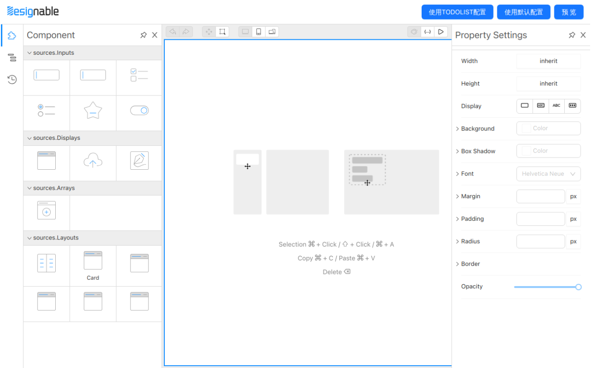
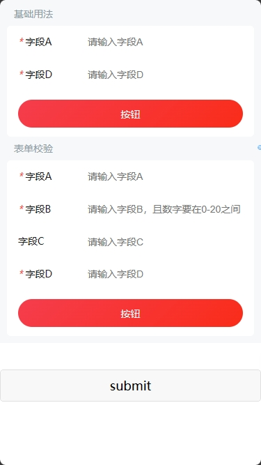

# 基于 Designable 开发 Taro小程序前端页面可视化搭建工具

这个分支还没做好 可以先看旧版taro3.6分支

## 目录介绍

```
├─ packages
  ├─ editor: 页面可视化搭建设计器，使用rspack构建并做了兼容Taro组件H5渲染处理
  ├─ mobile: Taro项目demo例子
  ├─ ui: 使用@nutui/nutui-react-taro组件库做的适配formily的组件
```

## 预览地址

可视化设计器（体积很大，注意流量，最好用PC打开） <https://lowcode-designable-taro-react.vercel.app>
demo H5（按 F12 切换设备仿真） <https://lowcode-designable-taro-react-mobile.vercel.app>




## 项目启动

**依赖安装**
本项目用了pnpm去做monorepo
根目录下

```bash
npm i -g pnpm
pnpm
```

**Taro Demo运行**
packages/mobile 目录下
编译微信小程序或淘宝(支付宝)小程序、h5

```bash
pnpm dev:weapp
```

```bash
pnpm dev:alipay
```

```bash
pnpm dev:h5
```

**可视化设计器启动**
packages/editor 目录下
`packages/editor/start.js` 中可修改 `Taro Demo` 地址

```bash
npm start
```

## 介绍文章

目前组件比较少，如有需要上生产建议按自身业务搭一套

[0前端可视化搭建与designable](./article/0%E5%89%8D%E7%AB%AF%E5%8F%AF%E8%A7%86%E5%8C%96%E6%90%AD%E5%BB%BA%E4%B8%8Edesignable.md)
[1物料组件库、协议和渲染器、designable设计器](./article/1%E7%89%A9%E6%96%99%E7%BB%84%E4%BB%B6%E5%BA%93%E3%80%81%E5%8D%8F%E8%AE%AE%E5%92%8C%E6%B8%B2%E6%9F%93%E5%99%A8%E3%80%81designable%E8%AE%BE%E8%AE%A1%E5%99%A8.md)
[2Taro小程序H5渲染JSONSchema](./article/2Taro%E5%B0%8F%E7%A8%8B%E5%BA%8FH5%E6%B8%B2%E6%9F%93JSONSchema.md)
3事件系统(开坑中)
4数组组件(开坑中)
